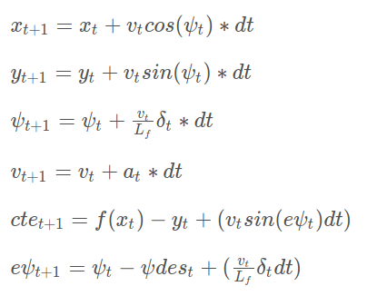

# Model Predictive Control
Self-Driving Car Engineer Nanodegree Program

Video to the final result: <a href="https://youtu.be/iaAlK1YVHXQ">https://youtu.be/iaAlK1YVHXQ</a>

---

## Dependencies

* cmake >= 3.5
 * All OSes: [click here for installation instructions](https://cmake.org/install/)
* make >= 4.1(mac, linux), 3.81(Windows)
  * Linux: make is installed by default on most Linux distros
  * Mac: [install Xcode command line tools to get make](https://developer.apple.com/xcode/features/)
  * Windows: [Click here for installation instructions](http://gnuwin32.sourceforge.net/packages/make.htm)
* gcc/g++ >= 5.4
  * Linux: gcc / g++ is installed by default on most Linux distros
  * Mac: same deal as make - [install Xcode command line tools]((https://developer.apple.com/xcode/features/)
  * Windows: recommend using [MinGW](http://www.mingw.org/)
* [uWebSockets](https://github.com/uWebSockets/uWebSockets)
  * Run either `install-mac.sh` or `install-ubuntu.sh`.
  * If you install from source, checkout to commit `e94b6e1`, i.e.
    ```
    git clone https://github.com/uWebSockets/uWebSockets
    cd uWebSockets
    git checkout e94b6e1
    ```
    Some function signatures have changed in v0.14.x. See [this PR](https://github.com/udacity/CarND-MPC-Project/pull/3) for more details.

* **Ipopt and CppAD:** Please refer to [this document](https://github.com/udacity/CarND-MPC-Project/blob/master/install_Ipopt_CppAD.md) for installation instructions.
* [Eigen](http://eigen.tuxfamily.org/index.php?title=Main_Page). This is already part of the repo so you shouldn't have to worry about it.
* Simulator. You can download these from the [releases tab](https://github.com/udacity/self-driving-car-sim/releases).
* Not a dependency but read the [DATA.md](./DATA.md) for a description of the data sent back from the simulator.


## Basic Build Instructions

1. Clone this repo.
2. Make a build directory: `mkdir build && cd build`
3. Compile: `cmake .. && make`
4. Run it: `./mpc`.

### How the project works

The project uses a model predictive control (MPC) to predict the next vehicle inputs. The MPC is based on a  Dynamic model to predict the behavior of the car given two inputs. The throttle and the steering angle. The dynamic model follows the following formula:



A self-driving car is made of multiples part such that the localization, the mapping, and the control. In this project, we assume the localization and the mapping are done. Thus, the simulator comes up with a set of waypoints. The first step is to convert each waypoint from the world to the vehicle coordinate system. Then, we can use this set of points to fit a polynomial function is used as the trajectory to follow (in yellow on the video). See: <b>MPC::WaypointsToVehiclesPoints</b> and <b>MPC::kinematicModel</b>.

The next part of the project combined the reference trajectory and the dynamic model. Using the ipopt library we can set the behavior of the model and optimize it which respect to the throttle and the steering angle. The error depends on four factors:
<ul>
 <li>The cross track</li>
 <li>The orientation error</li>
 <li>The speed error</li>
 <li>The gap between sequential actuations</li>
<ul>
 
 
 ```[c++]
 
    // The part of the cost based on the reference state.
    for (int t = 0; t < N; t++) {
      fg[0] += 20000*CppAD::pow(vars[cte_start + t], 2);
      fg[0] += 200000*CppAD::pow(vars[epsi_start + t], 2);
      fg[0] += CppAD::pow(vars[v_start + t] - 100, 2);
    }

    // Minimize the value gap between sequential actuations.
    for (int t = 0; t < N - 2; t++) {
      fg[0] += 700000 * (this->speed+1) * CppAD::pow(vars[delta_start + t + 1] - vars[delta_start + t], 2);
    }
 ```


Since everything is differentiable we can at each iteration optimize the model to reduce the error. Then, the first inputs control are returned by the method (<b>MPC::Solve</b>).


