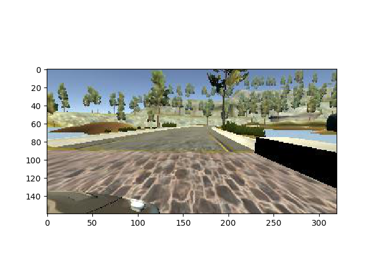

# Behaviorial Cloning Project

---

This repository contains starting files for the Behavioral Cloning Project from Udacity.

The project includes the following files:
* model.py containing the script to create and train the model
* drive.py for driving the car in autonomous mode
* writeup_report.md or writeup_report.pdf summarizing the results

## Setup the project:

### Download the simulator:
<ul>
    <li><a href="https://d17h27t6h515a5.cloudfront.net/topher/2017/February/58ae46bb_linux-sim/linux-sim.zip">Linux</a></li>
    <li><a href="https://d17h27t6h515a5.cloudfront.net/topher/2017/February/58ae4594_mac-sim.app/mac-sim.app.zip">macOS</a></li>
    <li><a href="https://d17h27t6h515a5.cloudfront.net/topher/2017/February/58ae4419_windows-sim/windows-sim.zip">Windows</a></li>
</ul>

### Download the dataset:

<a href="https://d17h27t6h515a5.cloudfront.net/topher/2016/December/584f6edd_data/data.zip">Download</a>
unzip the file at the root of the repository!!

### Install dependencies:

```sh
python3 -m virtualenv --python=python3 venv
. venv/bin/activate
pip install -r requirements.txt
```

### Train the model

```sh
python model.py
```

#### Test the model

To test the model, you first need to launch the python script drive.py. This one will create a socket server used to send steering angle predictions.

Using the Udacity provided simulator and the drive.py file, the car can be driven autonomously around the track by executing:

```sh
python drive.py model.h5
```

Then you can launch the Udacity provided simulator.

#### Model.py

The model.py is composed of 4 functions:
    <ul>
        <li><b>build_model: Method used to build the architecture with keras.</b></li>
        <li><b>plot_image: Utils method used to plot an image extracted from the dataset.</b></li>
        <li><b>get_data: Generator method, used to create batches.</b></li>
        <li><b>main: Function used to open the dataset, split it (training, validation) and train the model.</b></li>
    </ul>

Train the model:
```sh
python model.py
```

## Model Architecture and Training Strategy

I train the model using a convolutional neural network predicting one linear output. As I said above, the architecture is built in the build_method (model.py) method. In order to reduce the overfitting, I used data augmentation by flipping each image of the dataset and by using the left/right camera. I also add dropout just after the last convolution and after the first Fully connected layer. The model used an Adam optimizer, so the learning rate was not tuned manually. Then, for the architecture, the size and the number of filters have been set by many trial and error. For the training data, I used a combination of the central, left and right camera, each one, randomly flip. The training data is a subset of 85% of the total dataset.

## Final Model Architecture

The architecture is the following:
<ul>
    <li>One convolution of 8 filters (9*9) [Elu activation]</li>
    <li>One convolution of 16 filters (5*5) [Elu activation]</li>
    <li>One convolution of 32 filters (4*4) [Elu activation]</li>
    <li>Flatten layer</li>
    <li>Dropout: 0.6</li>
    <li>Fully conected: 1024 [Elu]</li>
    <li>Dropout: 0.3</li>
    <li>Fully conected: 1 (Linear output)</li>
</ul>

## Creation of the Training Set & Training Process

In the get_data method, I start to shuffle the dataset. Then, I go through each row where I randomly pick the center, left or right image. Then, I randomly choose to flip the image or not. If the image is flipped I multiply the angle by -1. Each time a new batch is ready, I return it using yield (Generator).



Before to be fitted into the network, each image is normalized by the following formula: (images / 127.5 - 1). Then I cropped it to remove useless image part (Sky, tree... etc).
