## Advanced Lane Finding
[](http://www.udacity.com/drive)

**Advanced Lane Finding Project**
The goals / steps of this project are the following:

* Compute the camera calibration matrix and distortion coefficients given a set of chessboard images.
* Apply a distortion correction to raw images.
* Use color transforms, gradients, etc., to create a thresholded binary image.
* Apply a perspective transform to rectify binary image ("birds-eye view").
* Detect lane pixels and fit to find the lane boundary.
* Determine the curvature of the lane and vehicle position with respect to center.
* Warp the detected lane boundaries back onto the original image.
* Output visual display of the lane boundaries and numerical estimation of lane curvature and vehicle position.

### Camera Calibration

My code for the Camera Calibration is located into the calibration.py file. This file is used to return the distortion coefficients and the camera matrix needed to transform 3D images points to 2D images points.

Distortion changes the size and shape of objects in an image, to fix this problem we need to calibrate the camera in order to undistorted each image. For the calibration, one solution is to use a known shape. A chessboard!

The real 3D images points are stored in a list: objpoints. These points are the coordinates of chessboard corners for a 6*9 grid. Then I create one empty list (imgpoints) to store the corners of the 2D images. I can detect the corners by using cv2.findChessboardCorners function after taking the grayscale of the original image.

Once 3D points and 2D points have been computed for all images, I use cv2.calibrateCamera to compute the distortion coefficients and the camera matrix. Then, I can use these two variables to undistorted any image taken with this camera by calling cv2.undistort.

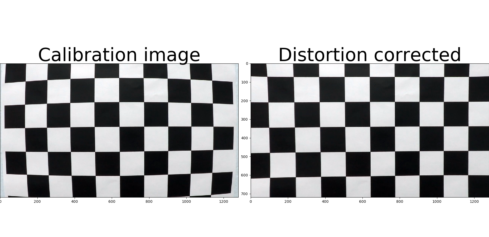

### Pipeline (single images)

#### 1. Example of a distortion-corrected image.

The distortion correction is made at line 543 in main.py file.
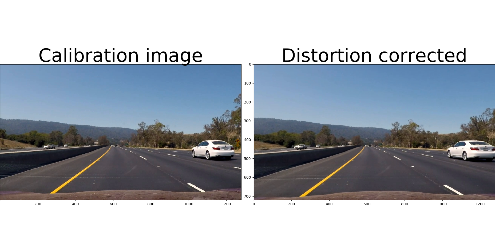

#### 2. Color/Gradients transforms.

Functions using the gradients to compute the thresholded binary image can be found in the detector_function.py file. These methods are used inside the main.py file in the color_gradient_threshold function where I first use a combination of the Sobel operator, the gradient magnitude, and the gradient direction.

```python
gradx = abs_sobel_thresh(image, orient='x', sobel_kernel=9, thresh=(9, 120))
grady = abs_sobel_thresh(image, orient='y', sobel_kernel=9, thresh=(9, 120))
mag_binary = mag_thresh(image, sobel_kernel=9, mag_thresh=(9, 120))
dir_binary = dir_threshold(image, sobel_kernel=15, thresh=(0., 1.2))
# Combined all detections
combined = np.zeros_like(dir_binary)
combined[((gradx == 1) & (grady == 1)) | (((mag_binary == 1) & (dir_binary == 1)))] = 1
```

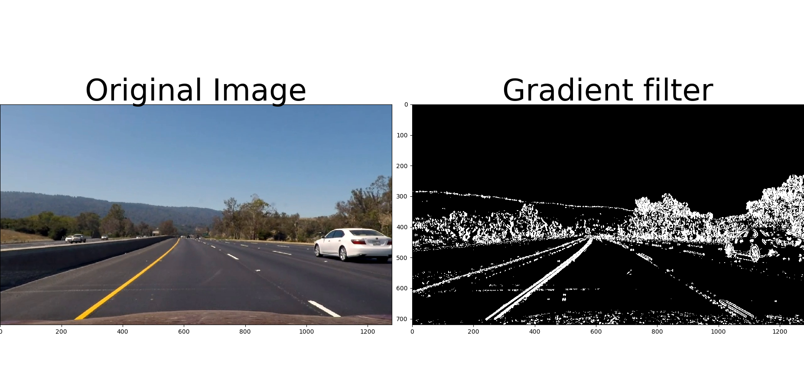

On the other side, I convert the image to HSL color space to create a new binary image based on the S and H channel (colors). I do not always use the H channel depending on the input image.

Then, I create another binary image based on the RGB colors (yw_binary). 

Finally, the results of the previous binary image are combined together.

```python
color_grad_binary[(colors == 1) & (combined == 1) & (yw_binary == 1)] = 1
```
The images below give some examples of the filters.


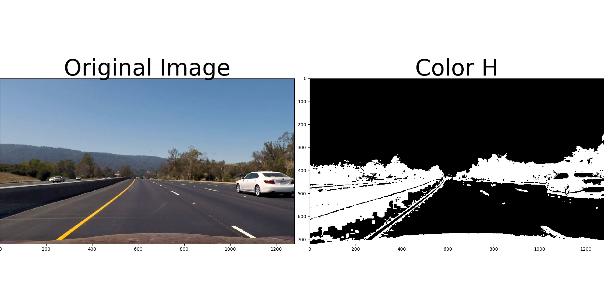
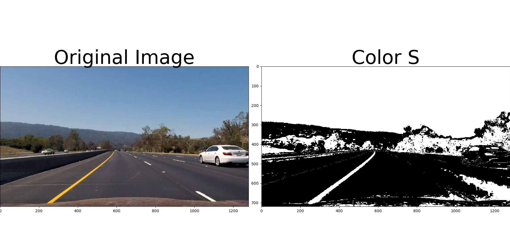

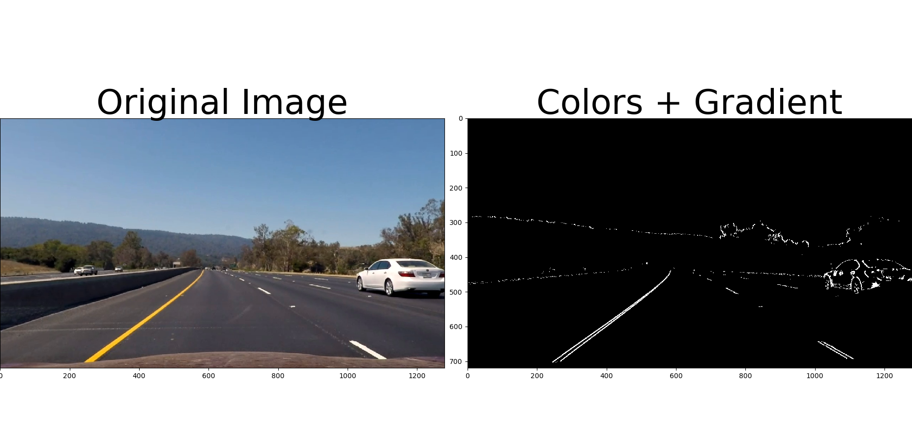

#### 3. Perspective transform

The perspective transform is written into the function: perspective_transform (main.py). I used the following mapping:

This resulted in the following source and destination points:

| Source (x, y)        | Destination (h: height, w: width, p: padding)   |
|:--------------------:|:-----------------------------------------------:|
| 530, 450             | p+150, p                                        |
| 730, 450             | h-p-150, p                                      |
| 1200, 670            | h-p-150, w-p                                    |
| 200, 670             | p+150, w-p                                      |

To compute the transformation, I first compute the transition Matrix M (and Minv) mapping sources point to destinations points using the following function: cv2.getPerspectiveTransform. Then, using the M matrix, I warp the binary image with the following function: cv2.warpPerspective.


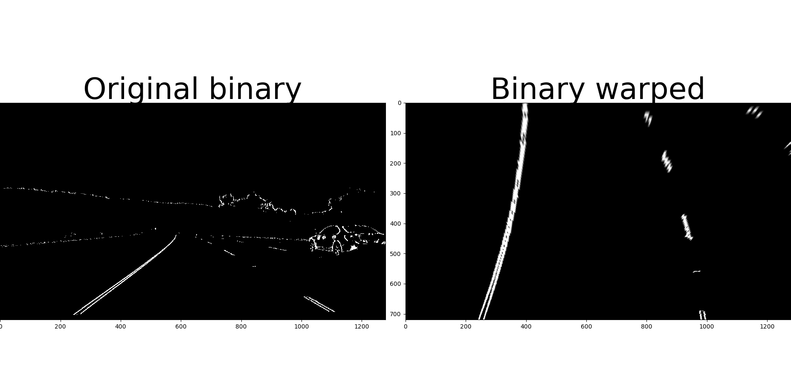


#### 4. Lane-line

The lines detection pipeline is implemented in the detect_lines function (main.py) using a sliding window. The pipeline is implemented in 4 different part:

<b>Part 1: Starting position</b>

The idea is to create a little window which slides along the image from the bottom to the top. To define the starting point of each window (left and right), We can compute the histogram along the x-axis and identify one peak on both sides.

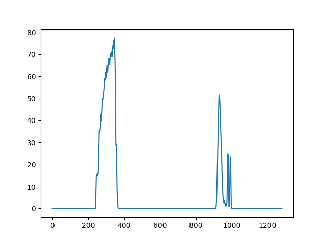

<b>Part2: Gather points</b>
At each iteration, all nonzero points in the window area are stored into a list. If there are not nonzero points in the area, I manually add some points in this area to better fit the line formula later.

<b>Part 3: Slides windows</b>
To move the line, I compute from my current position the mean x value of all non zero pixels in my area. Then I can move my window to the top using the x mean as my next position along the x-axis. For each window position, I memorize the window position for future use. Each peak corresponds to the starting position of one window. Sometimes, it is possible to define a position where no pixels take place, in this case, I take a look to the current history to set the position according to the history of the previous line. Or, if the current line is drawn enough, I try to predict the x position given the difference between the current window position and the starting window position. This approximation gives me roughly the current line slope to predict a position consistent with the current line.

<b>Part 4: Create the line formula</b>
Knowing that all points where the window passed through are stored in a list. We can use the numpy.polyfit function to create a quadratic function.

```python
# Line 431 in the detect_lines method (main.py)
left_fit = np.polyfit(lefty, leftx, 2)
right_fit = np.polyfit(righty, rightx, 2)
```

The lines above gives me three constant values for each line. In order to smooth the lines across images, I compute the average of each constant which respects to the last past ten previous lines constants.

```python
# Line 441 in the detect_lines method (main.py)
# Left constants
lx2 = np.array(self.left_fit_cr)[:,0].mean()
lx1 = np.array(self.left_fit_cr)[:,1].mean()
lx = np.array(self.left_fit_cr)[:,2].mean()
# Right constants
rx2 = np.array(self.right_fit_cr)[:,0].mean()
rx1 = np.array(self.right_fit_cr)[:,1].mean()
rx = np.array(self.right_fit_cr)[:,2].mean()
```

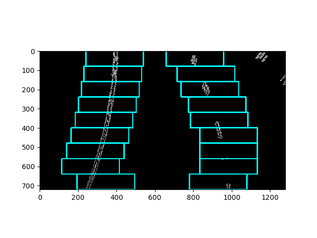


#### 5. Radius of curvature of the lane and position of the vehicle with respect to center.

The function to measure the curvature of the line is in the method: detect_curvature (main.py) while the vehicle position is computed in the method: detect_car_position.

The radius of curvature is compute using the following formula:

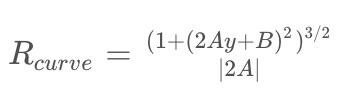

Where:

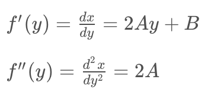

To get the position of the car, I make the difference between the two detected lines to get the center of the road, then I subtract the middle of the road to the center of the image (the camera is mounted at the center of the car). Finally, I multiply the result to go from pixel to meters. A negative result means the car is on the left of the road center while a positive result mean the car is on the right.

```python
car_position = (camera_position - center) * xm_per_pix
```

#### 6. Final result

The function which Implement almost all the steps of the project is...

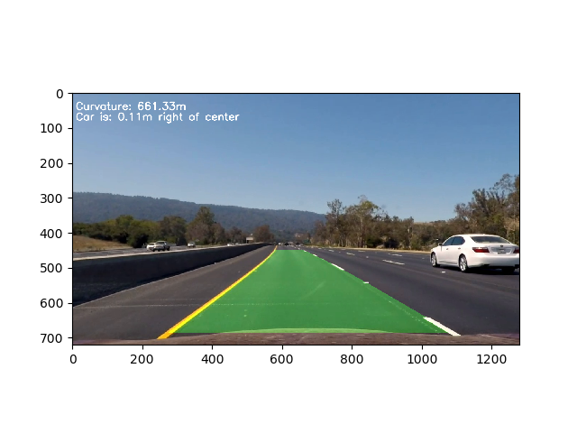

---

### Pipeline (video)

Here's a [link to my video result](https://github.com/thibo73800/self-driving-car/blob/master/p4-advanced-lane-lines/output.mp4)

---

### Discussion

To make this pipeline works well on the project video, I combined many filters. This is why there are many hyperparameters to tunes to get a well suited binary image. The current filters work well on the project video. However, to support more generic videos, I guess I should pass more time to create a better representation. I worked a lot on lines detection to find the solution describe above. I think this one is robust enough for simple roads. For trickiest roads, I would change the lines detection pipeline to keep track of more pieces of information, try different combinations of possible lines and picking the one which is more likely to be the right solution given the current image and previous images.

