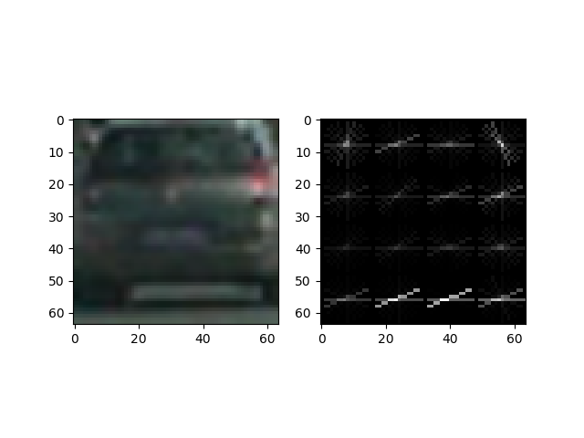
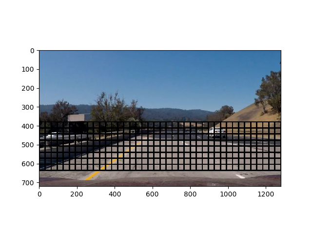
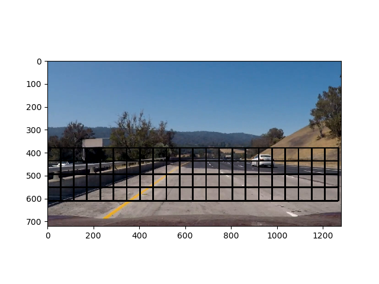
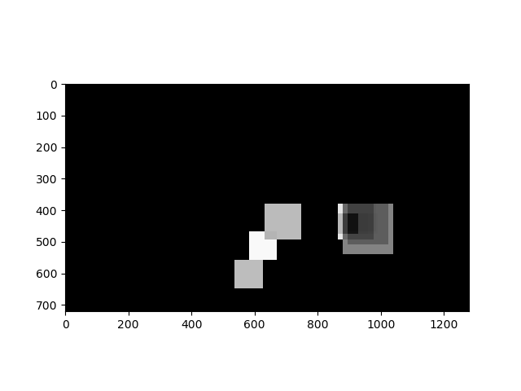
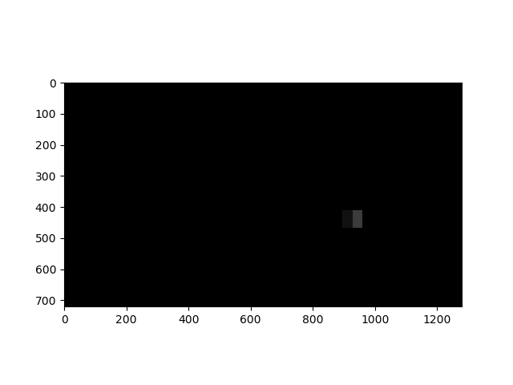
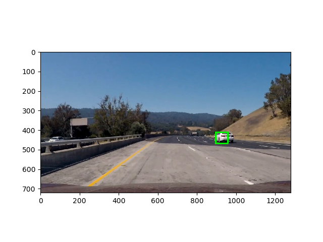
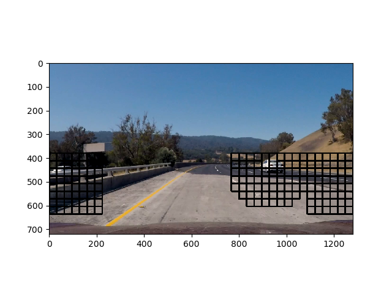
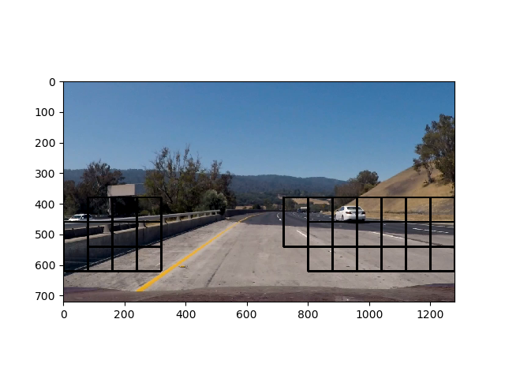

## Writeup Template
### You can use this file as a template for your writeup if you want to submit it as a markdown file, but feel free to use some other method and submit a pdf if you prefer.

---

**Vehicle Detection Project**

The goals / steps of this project are the following:

* Perform a Histogram of Oriented Gradients (HOG) feature extraction on a labeled training set of images and train a classifier Linear SVM classifier
* Optionally, you can also apply a color transform and append binned color features, as well as histograms of color, to your HOG feature vector.
* Note: for those first two steps don't forget to normalize your features and randomize a selection for training and testing.
* Implement a sliding-window technique and use your trained classifier to search for vehicles in images.
* Run your pipeline on a video stream (start with the test_video.mp4 and later implement on full project_video.mp4) and create a heat map of recurring detections frame by frame to reject outliers and follow detected vehicles.
* Estimate a bounding box for vehicles detected.

## How to use the project: 

The project is split into 5 python file.

* train.py: File used to train the classifier.
* process.py: This file takes as argument the path to the video to process, then launch the piepline to detect and track vehicles in the video.
* image.py: Image class to store information and method related to HOG features. This class is also used in the process.py pipeline to stored images with differents scale.
* car.py: When a car is detected in the image, a Car class is created. More information about this class is given further in this document.
* utils.py: Useful methods to plot a progress bar during the training.
 
### How to train the model:
`
  python train.py
`

### How to process the video:
`
  python process.py project_video.mp4
`

## [Rubric](https://review.udacity.com/#!/rubrics/513/view) Points
### Here I will consider the rubric points individually and describe how I addressed each point in my implementation.  

---
### Writeup / README

### Histogram of Oriented Gradients (HOG)

#### 1. Explain how (and identify where in your code) you extracted HOG features from the training images.

My classifier use HOG features. HOG features are based on the gradient magnitude and direction at each pixel. Then, the image is divided into small cells. Thus, we can compute a histogram of direction for each cell of the image. This method gives the possibility to detect the signature of an object’s shape easily. Instead of extract HOG features manually, I used the method hog from skimage.feature. This method takes three important parameters: orientations, pixels_per_cell and cells_per_block. To choose the best combinations of these values, I first plotted some images with their associated HOG features as bellow.

Then, once I was happy with what's the plotted HOG image looked like I tried to train the model by changing HOG parameters each time in order to improve the accuracy of the test set. I finally come up with the following values: orient: 10, pixels_per_cell: 16, orient: 2.

The code for this step is contained in the file <b>image.py</b> in the static method <b>get_hog_features</b>. I chose to use a simple RGB color space because it turns out that this is the space with the less number of False positive when I launch a test on the project video.

#### 2. Describe how (and identify where in your code) you trained a classifier using your selected HOG features (and color features if you used them).

For this project, I trained the model using a SVC model. SVC is part of the sklearn.svm library. SVC allows two interesting things, first I can use the kernel trick to classify binary data. Then, I can get the result of the prediction as a probability for both classes (car, non-car).I will explain further in this document why this is useful.

To train the classifier I compute HOG features for each image. Before to train the classifier, I normalize the features using the StandardScaler method from sklearn.preprocessing.

I train the SVC using normalized HOG features and “rbf” for the kernel trick. To come up with this choice, I tested all possible kernel by comparing each one against others, but it turns out that the best one is rbf. Finally, I achieve 99% accuracy on the test set.

The training part of the project is located in the file train.py. The creation of the dataset (including normalization) is in the <b>create_dataset</b> method. The image processing and features extraction are in the following function: <b>extract_features</b>. Finally, the training is in the method: <b>train_dataset</b>.

### Sliding Window Search

#### 1. Describe how (and identify where in your code) you implemented a sliding window search.  How did you decide what scales to search and how much to overlap windows?

The sliding windows search method is used to search for cars across different subregions of the images. To accelerate the processing of each image, I choose to extract HOG features only once per scale (I use 6 different scales). I reduced the area of interest: from 320px to 656px for the y-axis.

The first time the script is launch I search for a vehicles across all the x-axis. Then I will search only new cars on the left and right side of the image. Indeed, it is unlikely to see a new car appear at the center of the image, so we don’t need to search new cars at the center. However, I am also looking anyway for cars around the last positions where I previously detect some. Thus, I am able to track a car across a series of images, even if the car is in the center of the image.

The sliding window search is implemented in the file process.py in the method: <b>detect_new_cars</b>

#### 2. Show some examples of test images to demonstrate how your pipeline is working.  What did you do to optimize the performance of your classifier?

As I just said, I started by searching cars across all the x-axis and a subpart of the y-axis as the images below  show (multiple scales):

This first passed all over the road gives a first snapshot of possible cars position. Basically, at this level of the pipeline, the main thing I do to optimize the performance of my classifier is to get the probability of the classification (probability from 0 to 1) at each window instead of simply take the class prediction (O or 1). This little change allows me to get a heatmap with different detected windows as follow:

Then, I will filter this heat-map with a strong threshold in order to be sure to keep only the part of the heatmap with very strong confidence.

Thus, I can now look only on the left and right side of the image to search for new cars. But I will also look around the position of the previous detected car as the image bellow show (Once again with different scale):

### Video Implementation

#### 1. Provide a link to your final video output.  Your pipeline should perform reasonably well on the entire project video (somewhat wobbly or unstable bounding boxes are ok as long as you are identifying the vehicles most of the time with minimal false positives.)
Here's a [link to my video result](./project_video.mp4)

#### 2. Describe how (and identify where in your code) you implemented some kind of filter for false positives and some method for combining overlapping bounding boxes.

As I said earlier in this document, the sliding window search allows the detection of multiple positive boxes. In order to recognized false positive, I do not simply make a prediction using the predict method but using the predict_proba method. Thus, I get multiples boxes with different confidence. These boxes allow me to create a heat-map where I add +=confidence where "confidence" is the probability reported by my classifier for a given box. The next step is to compute a new heat-map which is the sum of the current heat-map and the previous ten heat-map. 

The method I just describe allows filtering a lot of False positive in the image. However, its turn out that some errors are harder to remove. This is why I created the class Car. 

Each time a box is detected into the heat-map, I create a Car entity. At the beginning, the car entity is not active. To be active, the entity needs to be confirmed many times. The confirmation happens when a sufficient amount of new boxes appear at the same location of the car entity. When the car entity turns active, I display it on the screen.

---

### Discussion

#### 1. Briefly discuss any problems / issues you faced in your implementation of this project.  Where will your pipeline likely fail?  What could you do to make it more robust?

I think the biggest problem with my pipeline is the time taken to process each image. Even though I compute HOG features once per scale. We could get better results by improving the sliding window search part. 

I passed a lot of time trying to handle False positive properly. I finnaly come up to the conclusion that HOG features are a good start for vehicle detections. However, the best way to detect vehicles would be to use a deep learning approach (convolutional neural network, RCNN) or a pre-trained model (Transfer learning) for instance.
