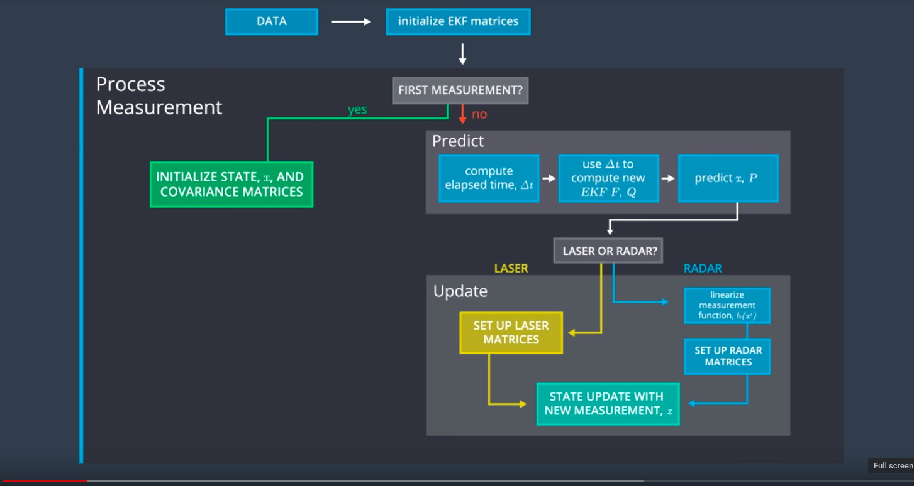
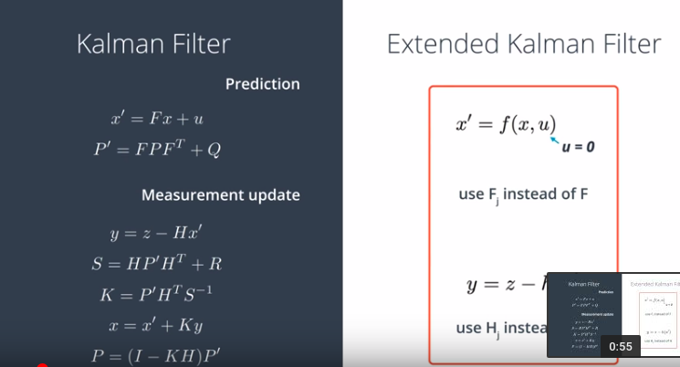

# Extended Kalman Filter Project Starter Code
Self-Driving Car Engineer Nanodegree Program

In this project I use a kalman filter to estimate the state of a moving object of interest with noisy lidar and radar measurements.

This project involves the Term 2 Simulator which can be downloaded [here](https://github.com/udacity/self-driving-car-sim/releases)

This repository includes two files that can be used to set up and install [uWebSocketIO](https://github.com/uWebSockets/uWebSockets) for either Linux or Mac systems. For windows you can use either Docker, VMware, or even [Windows 10 Bash on Ubuntu](https://www.howtogeek.com/249966/how-to-install-and-use-the-linux-bash-shell-on-windows-10/) to install uWebSocketIO. 

Once the install for uWebSocketIO is complete, the main program can be built and run (See the: "Basic Build Instructions" section).


---

# Project flow

## GLobal pipeline



The main flow of the Kalman filter algorithm is located into the file <b>FusionEKF.cpp</b> with the following methods:
```
 // Process each measurement
 void processMeasurement(const MeasurementPackage &measurement_pack);
 // Update the time from the last measurement
 float updateTime(const MeasurementPackage &measurement_pack);
 // Update the process covariance matrix Q
 float updateProcessCovariance(float dt);
 // Estimation part of the Kalman filter (Prediction + Correction)
 void  estimation(const MeasurementPackage &measurement_pack);
```

## Kalman filter: Math pipeline



The matrix and vectors operations used for the Kalman filter are implemented into <b>kalman_filter.cpp</b> with the following methods:

```
// Predict the next state
void predict();
// Update the state for Laser measurements
void update(const Eigen::VectorXd &z);
// Update the state for Ladar measurements
void updateEKF(const Eigen::VectorXd &z);
// Upate the state and the uncertainty covariance-matrix (For Laser and Radar)
void _update(const Eigen::VectorXd y, const Eigen::MatrixXd &H, const Eigen::MatrixXd R);
```
---

## Other usefull methods

Some important methods can be found into the <b>tools.cpp</b> file.

```
 // Method used to compute the RSME for each state value
 static VectorXd calculateRMSE(const vector<VectorXd> &estimations, const vector<VectorXd> &ground_truth);
 // Compute the Jacobian matrix (Hj)
 static MatrixXd calculateJacobian(const VectorXd& x_state);
 // Translate cartesian coordinate to polar coordinate
 static VectorXd cartToPolar(const VectorXd &state);
 // Translate polar coordinate to cartesian coordinate
 static VectorXd polarToCart(const VectorXd &state);
```


# Further informations

## Important Dependencies

* cmake >= 3.5
  * All OSes: [click here for installation instructions](https://cmake.org/install/)
* make >= 4.1 (Linux, Mac), 3.81 (Windows)
  * Linux: make is installed by default on most Linux distros
  * Mac: [install Xcode command line tools to get make](https://developer.apple.com/xcode/features/)
  * Windows: [Click here for installation instructions](http://gnuwin32.sourceforge.net/packages/make.htm)
* gcc/g++ >= 5.4
  * Linux: gcc / g++ is installed by default on most Linux distros
  * Mac: same deal as make - [install Xcode command line tools](https://developer.apple.com/xcode/features/)
  * Windows: recommend using [MinGW](http://www.mingw.org/)

## Build Instructions

1. Clone this repo.
2. Make a build directory: `mkdir build && cd build`
3. Compile: `cmake .. && make` 
   * On windows, you may need to run: `cmake .. -G "Unix Makefiles" && make`
4. Run it: `./ExtendedKF `


