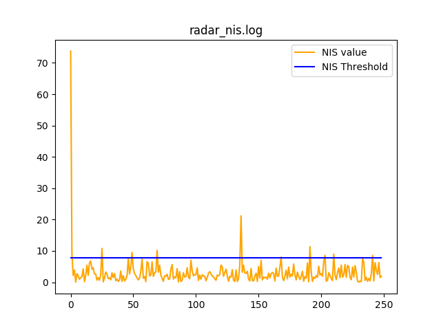
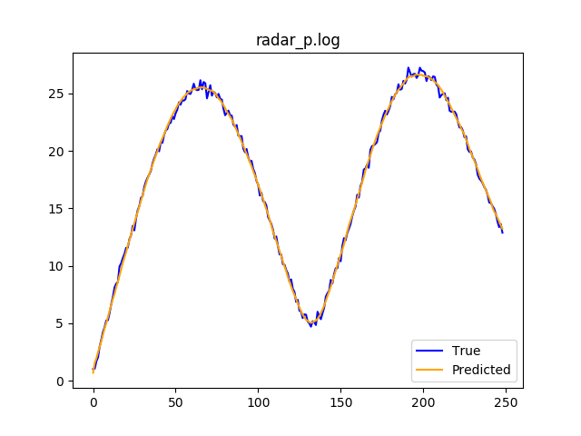
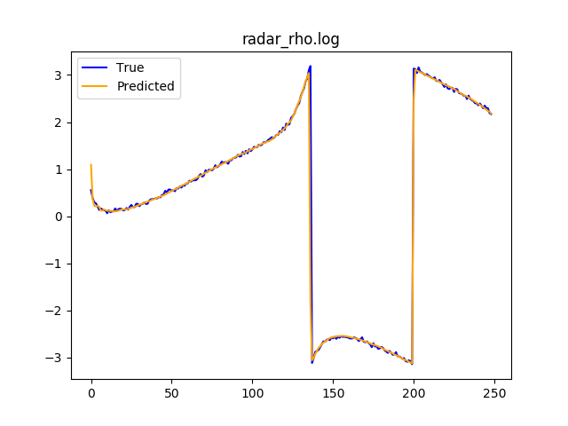
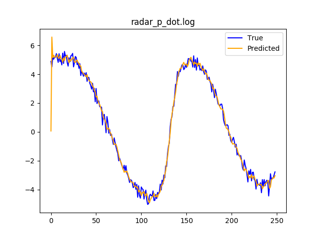
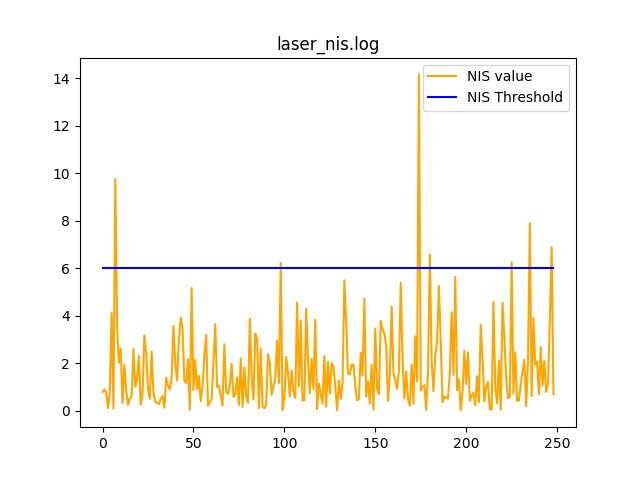
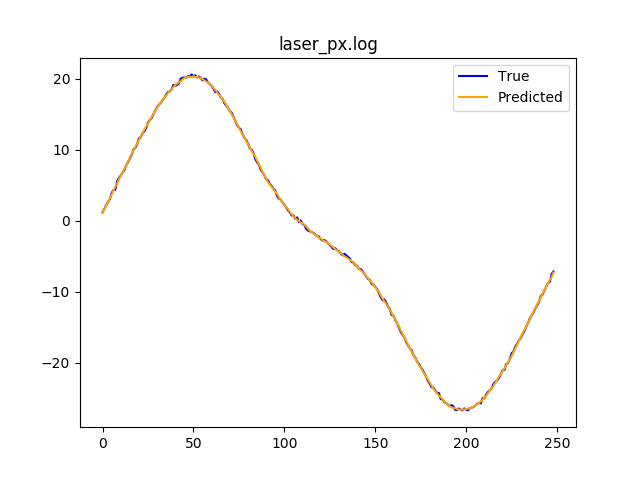
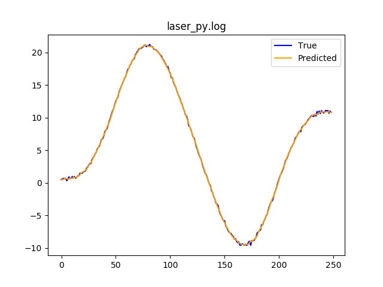

# Unscented Kalman Filter Project
Self-Driving Car Engineer Nanodegree Program

In this project I use an Unscented Kalman Filter to estimate the state of a moving object of interest with noisy lidar and radar measurements. 

This project involves the Term 2 Simulator which can be downloaded [here](https://github.com/udacity/self-driving-car-sim/releases)

This repository includes two files that can be used to set up and intall [uWebSocketIO](https://github.com/uWebSockets/uWebSockets) for either Linux or Mac systems. For windows you can use either Docker, VMware, or even [Windows 10 Bash on Ubuntu](https://www.howtogeek.com/249966/how-to-install-and-use-the-linux-bash-shell-on-windows-10/) to install uWebSocketIO. Please see [this concept in the classroom](https://classroom.udacity.com/nanodegrees/nd013/parts/40f38239-66b6-46ec-ae68-03afd8a601c8/modules/0949fca6-b379-42af-a919-ee50aa304e6a/lessons/f758c44c-5e40-4e01-93b5-1a82aa4e044f/concepts/16cf4a78-4fc7-49e1-8621-3450ca938b77) for the required version and installation scripts.

Once the install for uWebSocketIO is complete, the main program can be built and ran by doing the following from the project top directory.

1. mkdir build
2. cd build
3. cmake ..
4. make
5. ./UnscentedKF

---

## Unscented Kalman Filter implementation

The implementation of the UKF is located into src/ukf.cpp with the following methods

```
// Method used to process each new measurement
void        ProcessMeasurement(MeasurementPackage meas_package);
// When the current state is already Init, this method is called
void        Estimation(MeasurementPackage meas_package);
// Util method to compute the time difference from the last measurement
float       UpdateTime(const MeasurementPackage &measurement_pack);

// [Prediction Steps]
void        Prediction(double delta_t);
// Select augmented sigma points
MatrixXd    GenerateAugmentedSigmaPoints();
// Predict the value of each sigma points
MatrixXd    SigmaPointPrediction(const MatrixXd &Xsig_aug, double dt);
// Predict a new mean and new covariance matrix using sigma points
void        PredictMeanAndCovariance(MatrixXd Xsig_pred);

// [Update from measurement]
// Translate predicted sigma points to the appropriate space
void        PredictLaserMeasurement();
// Update step for the lisar measurements
void        UpdateLidar(MeasurementPackage meas_package);
// Translate predicted sigma points to the appropriate space
void        PredictRadarMeasurement();
// Update step for the radar measurements
void        UpdateRadar(MeasurementPackage meas_package);


```

## Results

### Radar






### Lidar






## Other Important Dependencies
* cmake >= 3.5
  * All OSes: [click here for installation instructions](https://cmake.org/install/)
* make >= 4.1 (Linux, Mac), 3.81 (Windows)
  * Linux: make is installed by default on most Linux distros
  * Mac: [install Xcode command line tools to get make](https://developer.apple.com/xcode/features/)
  * Windows: [Click here for installation instructions](http://gnuwin32.sourceforge.net/packages/make.htm)
* gcc/g++ >= 5.4
  * Linux: gcc / g++ is installed by default on most Linux distros
  * Mac: same deal as make - [install Xcode command line tools](https://developer.apple.com/xcode/features/)
  * Windows: recommend using [MinGW](http://www.mingw.org/)

## Basic Build Instructions

1. Clone this repo.
2. Make a build directory: `mkdir build && cd build`
3. Compile: `cmake .. && make`
4. Run it: `./UnscentedKF` Previous versions use i/o from text files.  The current state uses i/o
from the simulator.


