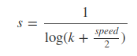
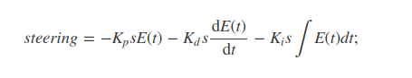

# CarND-Controls-PID
Self-Driving Car Engineer Nanodegree Program

---

In this project, I implemented a PID control to reduce the error between the position of the car and the center of the road. In this project, the error is given by the environment. PID stands for Proportional Integral Derivative. Each of these terms refers to a constant value Kp, Ki, and Kd.

The proportional factor changes the error in proportion to the current Error. 

In the Integral path, the error is summed up at each iteration, then the error is reduced in proportion to the sum of past error. This factor is used to remove continuous errors in the control system. It does not matter how large the constant error is, by summing the error values we can reach a value large enough to reduce the error anyway.

For the derivative factor, this is the rate of change that contributes to the change. When the change in error is moving slowly, then the derivative path is small, when the difference is large, the derivative is large too.

By summing these three change, we end up with the final correction.

In this project, I used the following constant values:

<ul>
 <li>Kp: 0.3</li>
 <li>Ki: 0.0001</li>
 <li>Kd: 2.0</li>
</ul>

I come up with these values by tweaking the parameters by hand, starting with a very slow throttle: 0.1. By doing so, it was easy to find good parameters. I then begin to increase the throttle to 0.2 to find better parameters. I quickly realized that it would be difficult to find efficient parameters working regardless the speed of the car. This is why I have created an other factor relative to the current speed of the car:



where k is a constant >= 1.
Finally the final steering angle is the following 



A video of the car can be watch on <a href="https://youtu.be/rNLS6Bz2svs">this video</a>.

## Dependencies

* cmake >= 3.5
 * All OSes: [click here for installation instructions](https://cmake.org/install/)
* make >= 4.1(mac, linux), 3.81(Windows)
  * Linux: make is installed by default on most Linux distros
  * Mac: [install Xcode command line tools to get make](https://developer.apple.com/xcode/features/)
  * Windows: [Click here for installation instructions](http://gnuwin32.sourceforge.net/packages/make.htm)
* gcc/g++ >= 5.4
  * Linux: gcc / g++ is installed by default on most Linux distros
  * Mac: same deal as make - [install Xcode command line tools]((https://developer.apple.com/xcode/features/)
  * Windows: recommend using [MinGW](http://www.mingw.org/)
* [uWebSockets](https://github.com/uWebSockets/uWebSockets)
  * Run either `./install-mac.sh` or `./install-ubuntu.sh`.
  * If you install from source, checkout to commit `e94b6e1`, i.e.
    ```
    git clone https://github.com/uWebSockets/uWebSockets
    cd uWebSockets
    git checkout e94b6e1
    ```
    Some function signatures have changed in v0.14.x. See [this PR](https://github.com/udacity/CarND-MPC-Project/pull/3) for more details.
* Simulator. You can download these from the [project intro page](https://github.com/udacity/self-driving-car-sim/releases) in the classroom.

There's an experimental patch for windows in this [PR](https://github.com/udacity/CarND-PID-Control-Project/pull/3)

## Basic Build Instructions

1. Clone this repo.
2. Make a build directory: `mkdir build && cd build`
3. Compile: `cmake .. && make`
4. Run it: `./pid`.

Tips for setting up your environment can be found [here](https://classroom.udacity.com/nanodegrees/nd013/parts/40f38239-66b6-46ec-ae68-03afd8a601c8/modules/0949fca6-b379-42af-a919-ee50aa304e6a/lessons/f758c44c-5e40-4e01-93b5-1a82aa4e044f/concepts/23d376c7-0195-4276-bdf0-e02f1f3c665d)
